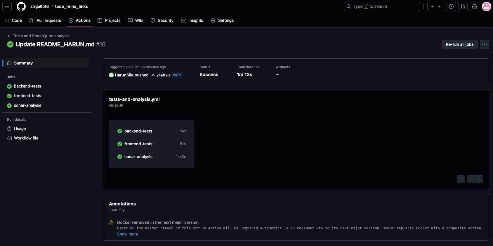
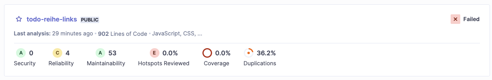
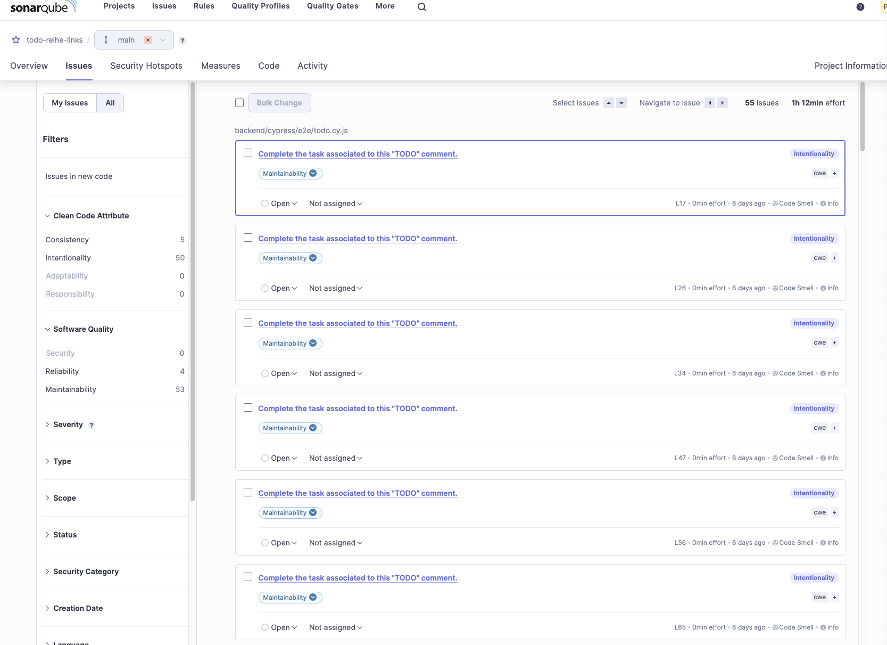
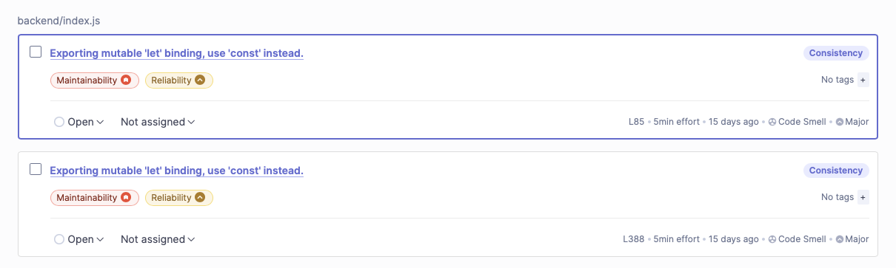

# Dokumentation Softwarequalität
| Name                 | Matrikelnummer        |
|----------------------|-----------|
| Christopher Schröpfer | 30267385 |
| Harun Silajdzija      | 30265109 |
| Philipp Spiertz       | 30253272 |

## Dokumentation der Erstellung von Unit-Tests für das Backend | Name: Christopher Schröpfer | Matrikelnummer: 30267385

### Vorgehensweise

Im Rahmen der Aufgabenstellung wurde die Backend-API um Unit-Tests ergänzt und bestehende Funktionalitäten verbessert. Ziel war es, eine gute Testabdeckung der API zu gewährleisten, indem Eingabedaten validiert und typische Anwendungs- und Fehlerfälle abgedeckt werden.

Zunächst wurde die bestehende Codebasis analysiert, um eine Übersicht über die vorhandenen Funktionen und möglichen Fehlerquellen zu erhalten. Dabei wurden die folgenden relevanten Endpunkte identifiziert:

- `GET /todos`
- `GET /todos/:id`
- `PUT /todos/:id`
- `POST /todos`
- `DELETE /todos/:id`

Für diese Endpunkte wurden Tests entworfen, die sowohl positive Szenarien (korrekte Eingabedaten) als auch negative Szenarien (fehlerhafte oder unvollständige Eingaben) abdecken.

Vor Beginn der Arbeiten waren bereits grundlegende Tests vorhanden. Diese Tests deckten die Authentifizierung sowie die grundlegende Funktionalität der Endpunkte ab. Sie prüften positive Szenarien, wie z. B. das Abrufen oder Erstellen von Todos, sowie negative Szenarien, wie beispielsweise die Abfrage eines Todos anhand einer ungültigen ID.

Die Implementierung der Tests erfolgte mit dem Framework supertest, das eine einfache Möglichkeit bietet, HTTP-Anfragen an die API zu simulieren. Dabei wurde supertest in Kombination mit dem Test-Framework jest eingesetzt. Während supertest die eigentlichen HTTP-Anfragen erstellt und die API-Endpunkte testet, übernimmt jest die Rolle des Test-Runners und stellt die Assertions sowie die Ausführung und Organisation der Tests sicher.

Diese Kombination ermöglicht ein effizientes Testen der API, da supertest die API-Aufrufe wie ein echter Client ausführt, während jest sicherstellt, dass die Ergebnisse den Erwartungen entsprechen. Beispielsweise wird überprüft, ob die API den korrekten HTTP-Statuscode zurückgibt oder ob die Antwort die erwarteten Felder enthält.

Zusätzlich wurde die Backend-Validierung erweitert, um Fehler frühzeitig abzufangen und präzisere Fehlermeldungen an den Client zu liefern.

---

### Gewählte Lösungen

#### 1. Erweiterung der Validierung
Die Validierung der Eingabedaten wurde um folgende Aspekte ergänzt:

- Prüfung auf korrektes Format der MongoDB-IDs (`isMongoId`).
- Sicherstellung, dass alle erforderlichen Felder (`title`, `due`, `status`) vorhanden und vom korrekten Typ sind.
- Beschränkung der erlaubten Zeichenlänge für das Feld `title` auf 3–100 Zeichen.
- Validierung des Statusfelds, um nur Werte zwischen 0 und 2 zu akzeptieren.
- Prüfung von Datumsfeldern auf Konformität zur ISO 8601.

Diese Validierungsregeln wurden mit Hilfe von `express-validator` definiert und bei den entsprechenden Endpunkten eingebunden. Dadurch wird sichergestellt, dass nur valide Daten in die Datenbank gelangen.

#### 2. Implementierung der Unit-Tests
Für jeden Endpunkt wurden mehrere Testszenarien erstellt:

- **GET /todos**:
  - Erfolgreicher Abruf aller Todos.
  - Fehler bei fehlerhaften Format der ID.

- **POST /todos**:
  - Erfolgreiche Erstellung eines neuen Todos.
  - Fehler bei unvollständigen Eingaben.
  - Fehler bei zusätzlichen nicht erlaubten Feldern.
  - Fehler bei der Angabe von Feldern mit einem falschen Datentyp.

- **GET /todos/:id**:
  - Erfolgreicher Abruf eines Todos.
  - Fehler bei Angabe einer nicht existierenden ID.

- **PUT /todos/:id**:
  - Erfolgreiche Aktualisierung eines Todos.
  - Fehler bei falschen Datentypen.
  - Fehler bei Angabe einer nicht existierenden ID.

- **DELETE /todos/:id**:
  - Erfolgreiche Löschung eines Todos.
  - Fehler bei Angabe einer nicht existierenden ID.

#### 3. Verbesserung der API-Fehlermeldungen
Die API wurde so angepasst, dass im Fehlerfall klar verständliche und spezifische Fehlermeldungen zurückgegeben werden. Beispielsweise werden bei Validierungsfehlern nun alle fehlerhaften Felder mit den jeweiligen Fehlermeldungen zurückgegeben.

---

### Probleme und deren Lösungen

#### Problem: Ungültige Datenformate
**Herausforderung:** Die API konnte Eingaben mit fehlerhaften oder unvollständigen Daten nicht angemessen verarbeiten.  
**Lösung:** Es wurden umfassende Validierungsregeln implementiert, die sicherstellen, dass nur gültige Eingaben akzeptiert werden.

#### Problem: Zusätzliche, nicht erlaubte Felder in Anfragen
**Herausforderung:** Nutzer konnten zusätzliche Felder in den Requests senden, die nicht zur API-Spezifikation gehörten.  
**Lösung:** Eine explizite Prüfung der übermittelten Felder wurde eingeführt. Bei Abweichungen wird ein 400-Fehler (Bad Request) zurückgegeben.

#### Problem: Unspezifische Fehlermeldungen bei PUT-/POST-Anfragen
**Herausforderung:** Die API gab teilweise unspezifische Fehlermeldungen wie „Bad Request“ aus, was die Fehlerbehebung erschwerte. Außerdem passten die Meldungen und Fehlercodes teilweise nicht zu den bereits vorhandenen Testfällen, sodass einige Testfälle grundsätzlich fehlschlugen.
**Lösung:** Die Fehlermeldungen wurden so überarbeitet, dass sie den genauen Grund des Fehlers benennen, z. B. „Titel muss mindestens 3 Zeichen lang sein“. Außerdem wurden die erwarteten Fehlermeldungen und -Codes in den Testfällen korrigiert.

#### Problem: Authentifizierungsprobleme bei Unit-Tests
**Herausforderung:** Einige Tests erforderten ein gültiges Authentifizierungstoken, obwohl der in der Datei `utils.js` angegebene Keycloak-Server nicht erreichbar war und nach Rücksprache mit Hr. Gawron auch nicht verwendet werden sollte.
**Lösung:** Die Datei `utils.js` wurde entfernt und die Testfälle wurden überarbeitet, sodass keine Authentifizierung mehr erforderlich war.

#### Problem: Bearbeitung und Löschen von Todos im Frontend nicht möglich
**Herausforderung:** Parallel zur Implementierung der Unit-Tests ist aufgefallen, dass das Bearbeiten und Löschen von Todos im Frontend nicht möglich war. Als Ursache stellte sich heraus, dass in den `onclick`-Events der Buttons mit den Klassen `status`, `edit` und `delete` keine Anführungszeichen um die ID des jeweiligen Todos vorhanden waren. Dadurch sind je nach verwendetem Browser verschiedene Fehler aufgetreten und in der Browser-Konsole protokolliert worden.
**Lösung:** Die fehlenden Anführungszeichen wurden ergänzt.

#### Problem: Fehlerhafter Umgang mit IDs im Frontend
**Herausforderung:** Ebenfalls parallel zur Implementierung der Unit-Tests fiel auf, dass das Frontend von numerischen IDs ausgegangen ist. Außerdem wurde das ID-Feld im Frontend `id` genannt, obwohl der korrekte durch die MongoDB erstellte Feldname `_id` lautet. Darüber hinaus wurde die ID nach dem Speichern im Frontend nicht zurückgesetzt, was zu Problemen bei der Speicherung weiterer Todos geführt hat.
**Lösung:** Das Frontend wurde angepasst, sodass das ID-Feld den Namen `_id` hat und die ID nicht mehr in einen Integer konvertiert wird. Zusätzlich wird die ID nun nach dem Speichern via `evt.target._id = ""` zurückgesetzt.

#### Problem: Fehlercode 500 bei PUT mit nicht existierender ID
**Herausforderung:** Bei der Implementierung der Unit-Tests wurde festgestellt, dass bei einem PUT-Aufruf mit einer nicht existierenden ID ein 500-Fehler (Internal Server Error) auftritt. Korrekt wäre in diesem Fall allerdings ein 404-Fehler (Not Found).
**Lösung:** Die Datei `db.js` wurde angepasst, sodass im Fall von `result.matchedCount === 0` null zurückgegeben wird. Dadurch wird sichergestellt, dass in diesem Fall durch die bereits vorhandene Logik ein 404-Fehler an das Frontend zurückgegeben wird.

## 🚀 DOKUMENTATION ZUR TESTIMPLEMENTIERUNG MIT CYPRESS 📋

Name: Harun Silajdzija | Matrikelnummer: 30265109

### ✨ Einführung und Setup

Zunächst habe ich einen Feature-Branch vom Main-Branch erstellt, nachdem sichergestellt wurde, dass alle Unit-Tests korrekt laufen und keine funktionalen Probleme bestehen.
Anschließend habe ich ein Codespace eingerichtet und im backend-Verzeichnis die notwendigen Abhängigkeiten mit 'npm install' installiert. Die Anwendung konnte anschließend erfolgreich mit 'npm run start' gestartet werden.

### 🧪 Manueller UI-Test und E2E Testabdeckung

Nach einem kurzen manuellen UI-Test, bei dem alle Funktionalitäten überprüft wurden, habe ich eine Liste der Testfälle erstellt, um sicherzustellen, dass die E2E-Testabdeckung gewährleistet ist:

- Seite todo.html laden
- 3 ToDos hinzufügen:
    - Fall 1: Datum vor einem Tag + Status „erledigt”
    - Fall 2: Datum heute + Status „in Bearbeitung”
    - Fall 3: Datum 1 Tag später + Status „offen”
    - Erwartetes Ergebnis: Es werden 3 ToDos gelistet.
- [Bearbeiten Button] ToDo 2 bearbeiten (Name, Datum, Status)
    - Erwartetes Ergebnis: Die neuen Daten werden korrekt im ToDo angezeigt.
- [Status Button] Einmal Status ändern
    - Erwartetes Ergebnis: Der neue Status wird korrekt für das ToDo in der Liste angezeigt.
- [Löschen Button] Löschen aller Testdaten

### 🔧 Integration von Cypress

Als nächstes habe ich das Cypress npm-Package installiert und eine cypress.config.js-Datei erstellt. Diese basierte auf der Konfiguration der vorherigen Übung. Die Installation erfolgte im Backend-Node-Projekt.

Die End-to-End-Tests befinden sich in der Datei backend/cypress/e2e/todo.cy.js. Zusätzlich gibt es in der Datei backend/cypress/support/e2e.js eine Grundkonfiguration, die für alle Tests geladen wird. Sie sorgt dafür, dass der Zustand des Browsers bereinigt wird, indem alle Cookies und der lokale Speicher gelöscht werden. Anschließend wird die Zielseite der Anwendung, in diesem Fall die todo.html, aufgerufen. Diese vorbereitenden Schritte gewährleisten, dass jeder Test in einer sauberen Umgebung startet, um zuverlässige und wiederholbare Ergebnisse zu ermöglichen.

Zusätzlich habe ich folgende Skripte in die package.json-Datei aufgenommen, um Cypress-Tests bequem ausführen zu können:
    "scripts": {
        "cy:open": "cypress open",
        "cy:run": "cypress run"
    }
Mit diesen Skripten kann man die Cypress Testlauf-Umgebung entweder im interaktiven Modus (cy:open) oder im Headless-Modus (cy:run) starten.

Beim ersten Testversuch mit Cypress trat eine Fehlermeldung auf, die darauf hinwies, dass Github beim Besuch der App-Seite eine Authentifizierung verlangt. Daher war es notwendig, den Port der Applikation im Codespace öffentlich freizugeben.

### ✅ Test-Erstellung und -Verifikation

Nach der erfolgreichen Integration von Cypress habe ich die Tests gemäß des oben genannten Testplans erstellt.
Beim Anlegen der ToDos habe ich darauf geachtet, die Attribute objekt-spezifisch zu prüfen, da es mehrere ToDos mit dem gleichen Datum und Status geben könnte.
Da die Tests echte Objekte in der Datenbank erstellen, konnte ich neben den Logmeldungen auch direkt in der Applikation überprüfen, ob die Tests korrekt ausgeführt wurden.

### 🗑️ Testdaten entfernen

Nachdem alle Tests implementiert und verifiziert waren, habe ich die Testdaten entfernt, um sicherzustellen, dass die Datenbank wieder im ursprünglichen Zustand ist.

## Dokumentation zur Erstellung des CI/CD-Workflows
* Name: Philipp Spiertz
* Matrikelnummer: 30253272

### Einleitung
Um die bereits erstellten Tests für das Frontend und das Backend so wie die Codeanalyse mit Hilfe von SonarQube automatisiert bei jeder Änderung laufen zu lassen ist es nötig, einen Workflow in GitHub anzulegen. Ein Workflow wird mit Hilfe einer yml-Datei angelegt. Diese muss im Verzeichnis .github/workflows erstellt werden. Es können beliebig viele Workflows angelegt werden, die dann bei bestimmten Events ausgeführt werden.

Ich habe mich dazu entschieden, alle Workflows in eine Konfigurationsdatei zu packen und dann alle Tests parallel laufen zu lassen und die Tests bei allen Aktionen auszuführen.

Auf die Konfiguration der einzelnen Jobs jobs wird in den Folgenden Abschnitten eingegangen.

### Tests für das Backend
Um das Backend zu testen, wurde als Basis für den Workflow ein Ubuntu-Image verwendet, was in `runs-on` angegeben wird. 

Da das Backend eine MongoDB-Datenbank benötigt und diese nicht weggemockt wurde, wird diese als Service in `services` hinzugefügt und ist mit den Standardwerten konfiguriert. Es wäre möglich, einen Nutzernamen und ein Passwort zu setzen, dies ist hier aber nicht nötig.

Damit MongoDB vom Backend erreicht werden kann, ist es nötig, die Ports hierfür anzugeben.

Als nächstes wird in `defaults` das Arbeitsverzeichnis angegeben, welches verwendet werden soll. Für diesen Job ist das Verzeichnis `backend`.

Nun werden die einzelnen Schritte in `steps` angegeben, die benötigt werden, um das Backend zu testen. Zuerst muss der Code ausgecheckt werden, was mit dem importierten Workflow `actions/checkout@v4` passiert.

Nachdem der Code im Workflow vorhanden ist, wird noch mit Hilfe von `actions/setup-node@v4` Node.js als JavaScript-Runtime in Version 20 hinzugefügt.

Damit das Backend gebaut bzw. die Tests ausgeführt werden können, werden die Abhängigkeiten mit Hilfe von `npm i` installiert.

Danach können die Tests mit `npm run test` ausgeführt werden. Wenn alles in Ordnung ist, dann quittiert GitHub die erfolgreiche Ausführung mit einem grünen Symbol in der Actions-Übersicht. Wie das aussieht, wird am Ende noch einmal gezeigt.

Konfiguration für die Backend-Tests:
```yml
backend-tests:
  runs-on: ubuntu-latest
  services:
    mongo:
      image: mongo
      ports:
        - 27017:27017
  defaults:
    run:
      working-directory: ./backend
  steps:
    - name: Check out repository
      uses: actions/checkout@v4
    - name: Setup Node.js
      uses: actions/setup-node@v4
      with:
        node-version: 20
    - name: Install dependencies
      run: npm i
    - name: Run backend tests
      run: npm run test
```
### Tests für das Frontend
Da das Frontend vom Backend als statische Dateien ausgeliefert wird, ist hierfür keine weitere Konfiguration notwendig. Somit sieht der Workflow für das Frontend bis auf den Befehl für die Ausführung der Tests identisch aus. Hier wird der Befehl `npm run cy:run` verwendet um Cypress zu starten und die Tests auszuführen.

Konfiguration für die Frontend-Tests:
```yml
frontend-tests:
  runs-on: ubuntu-latest
  services:
    mongo:
      image: mongo
      ports:
        - 27017:27017
  defaults:
    run:
      working-directory: ./backend
  steps:
    - name: Check out repository
      uses: actions/checkout@v4
    - name: Setup Node.js
      uses: actions/setup-node@v4
      with:
        node-version: 20
    - name: Install dependencies
      run: npm i
    - name: Start application
      run: npm run start &
    - name: Run Cypress tests
      run: npm run cy:run
```
### Codeanalyse mit SonarQube
Als letztes wird noch die Konfiguration von SonarQube vorgenommen. SonarQube ist eine Software, um Softwarequalität festzustellen und bietet auch die Möglichkeit, Vorschläge für die Verbesserung des Quellcodes zu machen. So kann während des Entwicklungsprozesses schon schnell für eine hohe Softwarequalität gesorgt werden.

Um SonarQube verwenden zu können ist es notwendig, ein neues Projekt in SonarQube anzulegen und sich dort dann einen Token für den Zugriff aus GitHub zu erstellen. Der Token und die Url der SonarQube-Instanz werden dann in die Secrets für die Actions des GitHub Projektes eingetragen und sind dann in jedem Durchlauf eines Workflows vorhanden und können verwendet werden, wie es in der Konfiguration ersichtlich ist.

Weiter musste noch der Key angegeben werden, der bei der Registrierung in SonarQube angegeben wurde. In diesem Fall `todo-reihe-links`. Als Vorlage für diesen Workflow diente der offizielle, [von SonarQube zur Verfügung gestellte](https://github.com/marketplace/actions/official-sonarqube-scan) Worflow.

Konfiguration von SonarQube:
```yml
sonar-analysis:
  runs-on: ubuntu-latest
  permissions:
    pull-requests: read
  steps:
    - name: Check out repository
      uses: actions/checkout@v4
    - name: SonarQube analysis
      uses: SonarSource/sonarqube-scan-action@master
      env:
        GITHUB_TOKEN: ${{ secrets.GITHUB_TOKEN }}
        SONAR_TOKEN: ${{ secrets.SONAR_TOKEN }}
        SONAR_HOST_URL: ${{ secrets.SONAR_HOST_URL }}
      with:
        args:
          -Dsonar.projectKey=todo-reihe-links
```

### Resultat
Nachdem die automatisierten Tests ausgeführt wurden, kann nun der Actions-Übersicht entnommen werden, ob diese erfolgreich waren.


Auf dem Bild sind erfolgreiche wie auch nicht erfolgreiche Durchläufe der Workflows zu sehen.

Wenn man einen Durchlauf anklickt, können auch die Ergebnisse der einzelnen Jobs eines Worflows angezeigt werden.


In diesem Bild sind die drei Jobs ersichtlich, die im Workflow für die einzelnen Aufgaben erfolgreich ausgeführt wurden. Hier ist es so, dass im normalen Betrieb nur die Tests für Frontend und Backend fehlschlagen können. Um Informationen über die Ergebnisse von SonarQube zu erhalten, muss dafür das Webinterface von SonarQube aufgerufen werden.



Wenn man nach dem Projekt in SonarQube sucht, kann man hier schon eine Übersicht über ein paar Metriken erhalten.

Wenn man das Projekt auswählt, kann man tiefer in die Probleme einsteigen, die SonarQube gefunden hat.

Was auffällt ist, dass SonarQube speziell für dieses Projekt viele Fehlalarme auslöst, da Todos in produktiv eingesetztem Code nicht erwünscht sind. Dadurch, dass es sich bei der analysierten Anwendung um eine Todo-App handelt, kommt das Wort Todo aber häufiger vor. Diese Fehlalarme können ignoriert werden.



Weiter findet SonarQube aber auch Probleme im Code selbst.



So schlägt SonarQube Refactorings vor, die den Code konsistenter machen.

Zusätzlich findet SonarQube auch Stellen im Code, in der z.B. Passwörter hart einprogrammiert sind. Zum Zeitpunkt der Erstellung dieser Dokumentation war das nicht mehr der Fall. Im ursprünglichen Code fand SonarQube aber genau solch ein Problem.

Zusammenfassend ist zu sagen, dass durch den Einsatz von SonarQube im Code schon viele Probleme erkannt werden können, ohne dass ein Entwickler nach jedem Commit ein genaues Codereview durchführen muss. Trotzdem erspart SonarQube nicht, die Software auch manuell zu testen und den Code unter den Gesichtspunkten von z.B. der Fachlichkeit auf Korrektheit zu untersuchen.

### Probleme beim Hinzufügen der Workflows
Beim Hinzufügen der Workflows kam es nur zu kleineren Problemen.

Am Anfang zeigte mir SonarQube an, dass bei der Analyse keine Quellcode-Dateien gefunden werden konnten. Das lag daran, dass der Code nicht ausgecheckt wurde, da dies explizit geschehen muss. Danach meldete SonarQube kein solches Problem mehr.

Ein weiteres Problem war die Art, wie das Setup für die Tests im Frontend durchgeführt wurde. Das führte dazu, dass die Tests immer failten, weil eine Bedingung im Workflow wie auch auch meinem Computer niemals zutraf.

Bis auf diese zwei kleinen Probleme war die Implementierung aber sehr einfach und sorgte für das Verständnis, dass es einfach ist Tools einzusetzen, die helfen, Code besser zu machen.