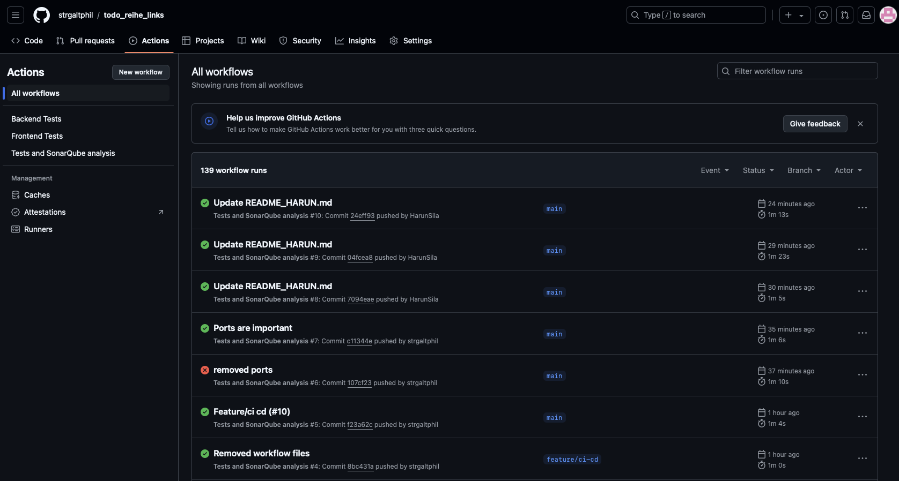
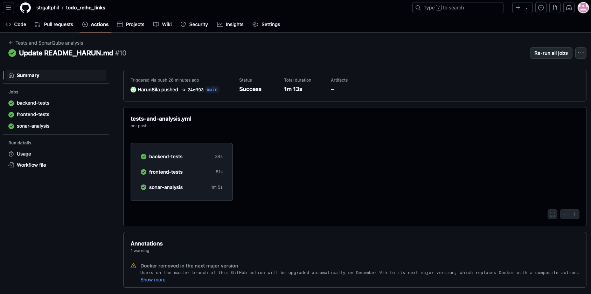
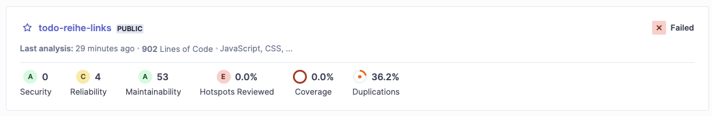
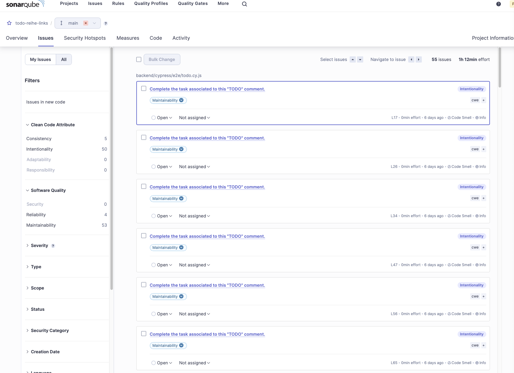
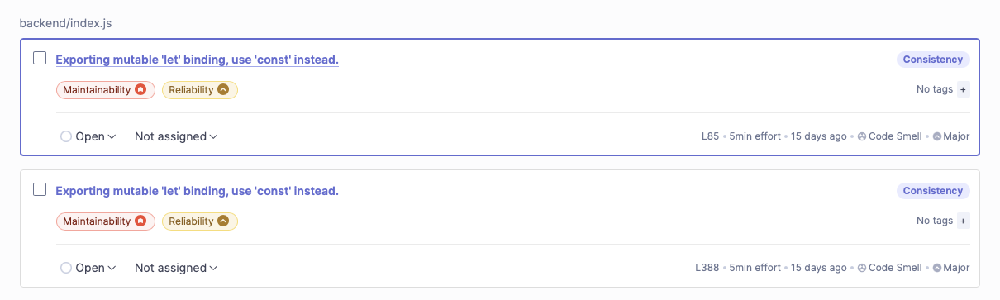

# Dokumentation zur Erstellung des CI/CD-Workflows
* Name: Philipp Spiertz
* Matrikelnummer: 30253272

## Einleitung
Um die bereits erstellten Tests für das Frontend und das Backend so wie die Codeanalyse mit Hilfe von SonarQube automatisiert bei jeder Änderung laufen zu lassen ist es nötig, einen Workflow in GitHub anzulegen. Ein Workflow wird mit Hilfe einer yml-Datei angelegt. Diese muss im Verzeichnis .github/workflows erstellt werden. Es können beliebig viele Workflows angelegt werden, die dann bei bestimmten Events ausgeführt werden.

Ich habe mich dazu entschieden, alle Workflows in eine Konfigurationsdatei zu packen und dann alle Tests parallel laufen zu lassen und die Tests bei allen Aktionen auszuführen.

Auf die Konfiguration der einzelnen Jobs jobs wird in den Folgenden Abschnitten eingegangen.

## Tests für das Backend
Um das Backend zu testen wurde als Basis für den Workflow ein Ubuntu-Image verwendet, was in `runs-on` angegeben wird. 

Da das Backend eine MongoDB-Datenbank benötigt und diese nicht weggemockt wurde, wird diese als Service in `services` hinzugefügt und ist mit den Standardwerden konfiguriert. Es wäre möglich, einen Nutzernamen und ein Passwort zu setzen, dies ist hier aber nicht nötig.

Damit MongoDB vom Backend erreicht werden kann ist es nötig, die Ports hierfür anzugeben.

Als nächstes wird in `defaults` das Arbeitsverzeichnis angegeben, welches verwendet werden soll. Für diesen Job ist das das Verzeichnis `backend`.

Nun werden die einzelnen Schritte in `steps` angegeben die benötigt werden, um das Backend zu testen. Zuerst muss der Code ausgecheckt werden, was mit dem importierten Workflow `actions/checkout@v4` passiert.

Nachdem der Code im Workflow vorhanden ist, wird noch mit Hilfe von `actions/setup-node@v4` Node.js als JavaScript-Runtime in Version 20 hinzugefügt.

Damit das Backend gebaut bzw. die Tests ausgeführt werden kann, werden die Abhängigkeiten mit Hilfe von `npm i` installiert.

Danach können die Tests mit `npm run test` ausgeführt werden. Wenn alles in Ordnung ist, dann Quittiert GitHub die erfolgreiche Ausführung mit einem Grünen Symbol in der Actions-Übersicht. Wie das aussieht, wird am Ende noch einmal gezeigt.

Konfiguration für die Backend-Tests:
```yml
backend-tests:
  runs-on: ubuntu-latest
  services:
    mongo:
      image: mongo
      ports:
        - 27017:27017
  defaults:
    run:
      working-directory: ./backend
  steps:
    - name: Check out repository
      uses: actions/checkout@v4
    - name: Setup Node.js
      uses: actions/setup-node@v4
      with:
        node-version: 20
    - name: Install dependencies
      run: npm i
    - name: Run backend tests
      run: npm run test
```
## Tests für das Frontend
Da das Frontend vom Backend als statische Dateien ausgeliefert wird, ist hierfür keine weitere Konfiguration notwendig. Somit sieht der Workflow für das Frontend bis auf den Befehl für die Ausführung der Tests identisch aus. Hier wird der Befehl `npm run cy:run` verwendet um Cypress zu starten und die Tests auszuführen.

Konfiguration für die Frontend-Tests:
```yml
frontend-tests:
  runs-on: ubuntu-latest
  services:
    mongo:
      image: mongo
      ports:
        - 27017:27017
  defaults:
    run:
      working-directory: ./backend
  steps:
    - name: Check out repository
      uses: actions/checkout@v4
    - name: Setup Node.js
      uses: actions/setup-node@v4
      with:
        node-version: 20
    - name: Install dependencies
      run: npm i
    - name: Start application
      run: npm run start &
    - name: Run Cypress tests
      run: npm run cy:run
```
## Codeanalyse mit SonarQube
Als letztes wird noch die Konfiguration von SonarQube vorgenommen. SonarQube ist eine Software, um Softwarequalität festzustellen und bietet auch die Möglichkeit, Vorschläge für die Verbesserung des Quellcodes zu machen. So kann während des Entwicklungsprozesses schon schnell für eine hohe Softwarequalität gesorgt werden.

Um SonarQube verwenden zu können ist es notwendig, ein neue Projekt in SonarQube anzulegen und sich dort dann einen Token für den Zugriff aus GitHub zu erstellen. Der Token und die Url der SonarQube-Instanz werden dann in die Secrets für die Actions des GitHub Projektes eingetragen und sind dann in jedem Durchlauf eines Workflows vorhanden und können verwendet werden, wie es in der Konfiguration ersichtlich ist.

Weiter musste noch der Key angegeben werden, der bei der Registrierung in SonarQube angegebene wurde. In diesem Fall `todo-reihe-links`. Als Vorlage für diesen Workflow diente der offizielle, [von SonarQube zur Verfügung gestellte](https://github.com/marketplace/actions/official-sonarqube-scan) Worflow.

Konfiguration von SonarQube:
```yml
sonar-analysis:
  runs-on: ubuntu-latest
  permissions:
    pull-requests: read
  steps:
    - name: Check out repository
      uses: actions/checkout@v4
    - name: SonarQube analysis
      uses: SonarSource/sonarqube-scan-action@master
      env:
        GITHUB_TOKEN: ${{ secrets.GITHUB_TOKEN }}
        SONAR_TOKEN: ${{ secrets.SONAR_TOKEN }}
        SONAR_HOST_URL: ${{ secrets.SONAR_HOST_URL }}
      with:
        args:
          -Dsonar.projectKey=todo-reihe-links
```

## Resultat
Nachdem die Automatisierten Tests ausgeführt wurden kann nun der Actions-Übersicht entnommen werden, ob diese Erfolgreich waren.



Auf dem Bild sind erfolgreiche wie auch nicht erfolgreiche Durchläufe der Workflows zu sehen.

Wenn man einen Durchlauf anklickt, können auch die Ergebnisse der einzelnen Jobs eines Worflows angezeigt werden.


In diesem Bild sind die drei Jobs ersichtlich, die im Workflow für die einzelnen Aufgaben erfolgreich ausgeführt wurden. Hier ist es so, dass im normalen Betrieb nur die Tests für Frontend und Backend fehlschlagen können. Um Informationen über die Ergebnisse von SonarQube zu erhalten, muss dafür das Webinterface von SonarQube aufgerufen werden.



Wenn man nach dem Projekt in SonarQube sucht, kann man hier schon eine Übersicht über ein paar Metriken erhalten.

Wenn man das Projekt auswählt, kann man tiefer in die Probleme einsteigen, die SonarQube gefunden hat.

Was auffällt ist, dass SonarQube speziell für dieses Projekt viele Fehlalarme auslöst, da Todos in produktiv eingesetztem Code nicht erwünscht sind. Dadurch, dass es sich bei der Analysierten Anwendung um eine Todo-App handelt, kommt das Wort Todo aber häufiger vor. Diese Fehlalarme können ignoriert werden.



Weiter findet SonarQube aber auch Probleme im Code selbst.



So Schlägt SonarQube Refactorings vor, die den Code konsistenter machen.

Zusätzlich findet SonarQube auch Stellen im Code, in der z.B. Passwörter hart einprogrammiert sind. Zum Zeitpunkt der Erstellung dieser Dokumentation war das nicht mehr der Fall. Im ursprünglichen Code fand SonarQube aber genau solch ein Problem.

Zusammenfassend ist zu sagen, dass durch den Einsatz von SonarQube im Code schon viele Probleme erkannt werden können, ohne dass ein Entwickler nach jedem Commit eine genaue Codereview durchführen muss. Trotzdem erspart SonarQube nicht, die Software auch manuell zu testen und den Code unter den Gesichtspunkten von z.B. der Fachlichkeit auf Korrektheit zu untersuchen.

## Probleme beim Hinzufügen der Workflows
Beim Hinzufügen der Workflows kam es nur zu kleineren Problemen.

Am Anfang zeigte mir SonarQube an, dass bei der Analyse keine Quellcode-Dateien gefunden werden konnten. Das lag daran, dass der Code nicht ausgecheckt wurde, da dies explizit geschehen muss. Danach meldete SonarQube kein solches Problem mehr.

Ein weiteres Problem war die Art, wie das Setup für die Tests im Frontend durchgeführt wurde. Das führte dazu, dass die Tests immer failten, weil eine Bedingung im Workflow wie auch auch meinem Computer niemals zutraf.

Bis auf diese zwei kleinen Probleme war die Implementierung aber sehr einfach und sorgte für das Verständnis, dass es einfach ist Tools einzusetzen, die helfen, Code besser zu machen.